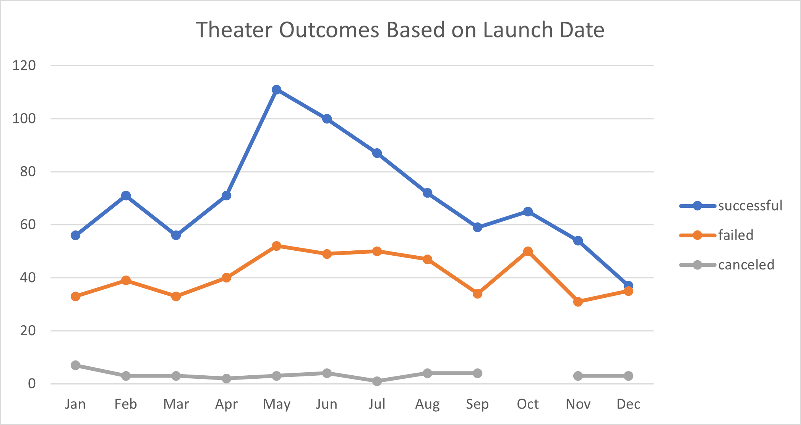

# Kickstarter-Challenge
Performing Analysis on kickstarter data to uncover trends

# Outcomes based on Goals

# Theater Outcomes by Launch Date

# My Analysis
## Overview of Project
To analyze what the data is telling us and get the information we exactly need. We wanted to see the number of outcomes(successul, failed, and canceled) under Theater category by Launch date and wanted to see how the outcomes look like based on the goals

## Analysis and Challenges
I answered the questions based on the images that I added here and it helped because I prefer visualization than a table of data. 
I am using Excel everyday for my current job, so I didn't encounter difficulties but I think I still need to refresh myself on how to use certain formulas

## Results

##### What are two conclusions you can draw about the Outcomes based on Launch Date?
Successful outcomes were the biggest number of all catetories(successful, failed, and canceled) and there is the biggest success in the May launching 

##### What can you conclude about the Outcomes based on Goals?
1) The percentage of Succsseful and the percentage of Failed are symmetrical. 
2) As the number of goal goes up, the percentage of Successful goes down but after the goal passes 25,000, the percentage of successful goes up and lastly, after 40,000, the percentage goes down. Vice versa on the percentage of Failed 

##### What are some limitations of this dataset?
I don't know if there is any limitations on this dataset..

##### What are some other possible tables and/or graphs that we could create?
I could use Column chart for both Theater outcomes by Launch Date and Outcomes based on Goals because it would show us visually which one has bigger numbers. 
